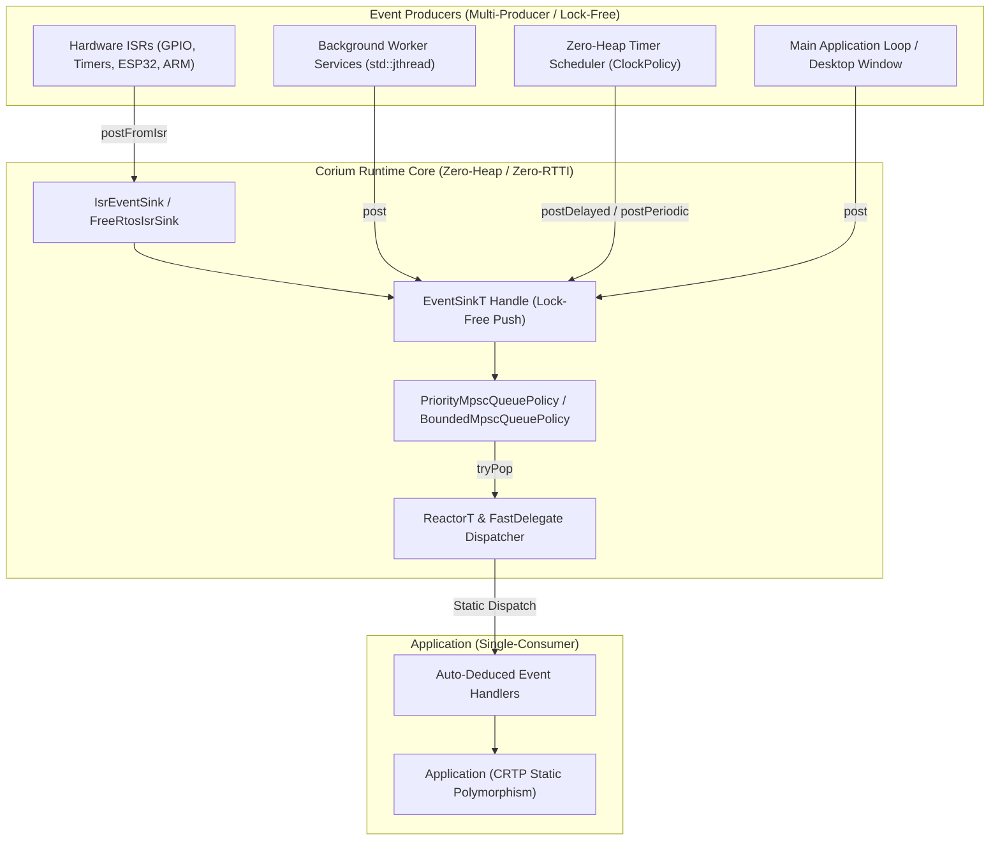

# Corium

**Corium** is a high-performance, header-only C++20 framework designed for **Multi-Producer Single-Consumer (MPSC)** event-driven architectures.

Engineered equally for **high-performance desktop applications (GUI event loops, game engines, audio/DSP processing, real-time desktop tools)** and **embedded microcontrollers & RTOS (ARM Cortex-M, ESP32, STM32, RP2040, FreeRTOS, Zephyr)**, Corium guarantees **zero dynamic memory allocations** on the heap, **zero virtual table / RTTI overhead**, and **pure compile-time static dispatching**.

---

## What is Corium?

Traditional C++ event libraries rely heavily on `std::function`, dynamic memory allocation (`new`/`malloc`), and virtual method dispatch (`override`). In real-time desktop software (game loops, audio engines, responsive UIs) or resource-constrained embedded systems, these mechanisms introduce:
- **Non-deterministic latency spikes** due to heap allocation and lock contention.
- **Memory fragmentation** over long execution periods.
- **Virtual table (vtables) and RTTI overhead**, which bloat binary size and reduce CPU cache efficiency.
- **Unsafe ISR execution**, as locking mutexes or allocating memory inside hardware interrupt routines results in deadlocks or system crashes.

**Corium solves this completely** by moving all type resolution, storage allocation, and policy choices to **compile time**. Multiple concurrent producers (hardware ISRs, background worker threads, user input events, timer loops) push events into a lock-free Vyukov ring buffer without acquiring locks or allocating heap memory. A single consumer thread processes and dispatches events via CRTP static polymorphism and FastDelegates.

---

## Architecture Overview



---

## Key Features

### Core Performance
- **Zero-Heap Allocation Guaranteed**: Hot-path event enqueueing, timer scheduling, and handler dispatching operate with **0 dynamic heap allocations**.
- **Zero RTTI & Zero Vtables**: Compiles cleanly with `-fno-rtti` and `-fno-exceptions`. Virtual methods are replaced by **CRTP static polymorphism** and FastDelegates.
- **Lock-Free MPSC Engine**: Multiple hardware interrupt handlers (ISRs) and worker threads push concurrently into Dmitry Vyukov's lock-free ring buffer algorithm.

### Embedded & RTOS Native
- **Hardware Clock Policies**: Parameterize timers using `ChronoClockPolicy`, `ManualClockPolicy` (simulation & testing), `MicrosecondTickClockPolicy<Provider>`, `MillisecondTickClockPolicy<Provider>`, `EspTimerClockPolicy` (ESP32 `esp_timer_get_time()`), or `FreeRtosClockPolicy` (`xTaskGetTickCount()`).
- **Hardware ISR Helpers**: Dedicated `IsrEventSink` and `FreeRtosIsrSink` handles supporting non-blocking interrupt pushes and context switch tracking (`xHigherPriorityTaskWoken` / `portYIELD_FROM_ISR()`).
- **RAII Interrupt Locking**: `InterruptLock` provides zero-overhead critical section masking across ARM CMSIS (`__disable_irq()`), ESP32 (`portENTER_CRITICAL()`), and desktop hosts.

### Priority & Overflow Management
- **Multi-Tier Event Priorities**: Native support for strict event priorities (`EventPriority::High`, `Normal`, `Low`). High-priority interrupt and emergency events are guaranteed to be dispatched ahead of standard background events.
- **Configurable Overflow Policies**: Transparent queue saturation strategies (`DropNewestOverflowPolicy`, `DropOldestOverflowPolicy`, `AuditOverflowPolicy`, `PanicOverflowPolicy`).

### Timers, Services & Safety
- **Zero-Heap Timer Scheduler**: Schedule single-shot delayed events (`postDelayed()`) or recurring periodic events (`postPeriodic()`) with cancellation handles (`cancelTimer()`) using static fixed-capacity storage.
- **Multi-Threaded Background Services**: Managed worker loops using C++20 `std::jthread` and `std::stop_token`, posting events concurrently with zero heap allocation.
- **C++20 Coroutine Combinators & Channels**: Zero-heap asynchronous `Task<T>`, bounded async `Channel<T, Capacity>` with backpressure, counting `AsyncSemaphore`, parallel `whenAll()`, fastest-wins `whenAny()`, atomic `CancellationToken`, and pull-based `Generator<T>` lazy sequences.
- **Active FSM Engine with Guard Conditions**: Variant-based compile-time `StateMachine`, predicate `Guard` conditions, `InternalTransition` (in-place actions without state exit/entry overhead), composite `ActionList`, and `ShallowHistory`.
- **Safety, Watchdogs & Observability**: Hardware Watchdog supervision (`WatchdogSupervisor`), lock-free circuit breaker (`CircuitBreaker`), circular in-memory flight recorder (`FlightRecorderProfiler`) exporting to Chrome Tracing / Perfetto, and zero-heap atomic `Metrics` (`Counter`, `Gauge`, `Histogram`) with Prometheus text export.
- **Deterministic Record & Replay**: Binary event journal (`EventJournalWriter` / `EventJournalReader`) with CRC-16 checksums and schema validation for black-box telemetry recording.
- **Embedded Bus & Network Adapters**: Hardware ISR adapters for SPI (`SpiAdapter`), I²C (`I2cAdapter`), CAN/CAN-FD (`CanAdapter`), DMA UART (`DmaUartBuffer`), and zero-copy UDP datagrams (`StaticUdpChannel`).
- **Static Topic-Based Event Router**: Multi-subscriber publish/subscribe fan-out dispatcher (`EventRouter`) with zero heap allocation.
- **Zero-Heap Structured Logging**: Fast structured zero-heap logging sinks including ANSI console, file, and structured JSON Lines (`JsonLogSink`).

---

## 📚 Documentation & Guides

| Guide | Description |
| :--- | :--- |
| 🏗️ [**Architecture Guide**](docs/ARCHITECTURE.md) | In-depth design philosophy, layer breakdown, lock-free queue mechanics, embedded footprint model, and module topology. |
| 🍳 [**Cookbook & Patterns**](docs/COOKBOOK.md) | 16 battle-tested design patterns (Request-Response, Parallel Coroutines, FSM Guards, JSON Logging, Zero-Copy IPC, Periodic Sampling, Circuit Breakers, Flight Recorder, Event Journal, SPI/I2C ISR, UDP Telemetry, Async Channels, Async Semaphore, Prometheus Metrics, EventRouter). |
| 🔄 [**Migration Guide**](docs/MIGRATION.md) | Transitioning from `std::function`, thread pools, `boost::asio`, or `boost::sml` to Corium. |
| ❓ [**Frequently Asked Questions (FAQ)**](docs/FAQ.md) | Answers to common architecture, capacity sizing, and bare-metal embedded questions. |
| 🛠️ [**Contributing Guidelines**](CONTRIBUTING.md) | Code standards, zero-heap verification, testing workflows, and commit conventions. |
| 📋 [**Changelog**](CHANGELOG.md) | Complete version history and release notes. |

---

## Feature Comparison Matrix

| Feature | Corium | Traditional Event Systems |
| :--- | :--- | :--- |
| **Dynamic Memory** | **0 Heap Allocations** (Static Arrays & Inline SBO) | Heap Allocation (`new`, `malloc`, `std::function`) |
| **Dispatch Mechanism** | **CRTP Static Polymorphism & FastDelegate** | Virtual Tables (`override`) & RTTI |
| **Thread Safety** | **Lock-Free MPSC** (Signal & ISR Safe) | Mutex Locks & Condition Variables |
| **Interrupt Safety (ISR)** | **100% Safe** (Lock-Free `IsrEventSink` / `FreeRtosIsrSink`) | Unsafe (Locks can deadlock ISR) |
| **Hardware Bus Adapters** | **Native SPI, I2C, CAN-FD, DMA UART Adapters** | Custom wrapper code with dynamic buffers |
| **Network & Telemetry** | **Zero-Copy UDP Datagrams (`StaticUdpChannel`)** | Socket libraries requiring dynamic buffers |
| **Hardware Clock Policies** | **Customizable Clock Sources** (Microsecond, Millisecond, ESP32, FreeRTOS, Manual) | Hardcoded `std::chrono::steady_clock` |
| **Priority Channels** | **Strict Multi-RingBuffer Priority Draining** | Dynamic Sorting / Heap Priority Queues |
| **Timer Scheduling** | **Zero-Heap Static Scheduler** | Dynamic Heap Timer Wheels / Heap Min-Heaps |
| **Async Coroutines** | **Zero-Heap Tasks, Channels, Semaphore, WhenAll, WhenAny, Generator** | Dynamic Coroutine Frame Allocations / Heap Callbacks |
| **Finite State Machine** | **Compile-Time Table, Guards, Internal Transitions, ActionList, History** | Dynamic Virtual State Objects / Heap Transitions |
| **Observability & Metrics** | **Prometheus Counters/Gauges/Histograms & Chrome Tracing JSON** | External dynamic metric libraries |
| **Record & Replay** | **Deterministic CRC-16 Event Journal (`EventJournalWriter/Reader`)** | Ad-hoc text logging without byte integrity |
| **Publish/Subscribe Routing**| **Topic-Based Static Fan-Out (`EventRouter`)** | Dynamic subscriber lists with `std::vector` |
| **Structured Logging** | **Zero-Heap ANSI, File, and JSON Lines (NDJSON)** | Heap-allocated string streams / formatting buffers |
| **Bare-Metal Support** | **Full Support** (`-fno-rtti -fno-exceptions`, <1KB RAM, ~4-8KB Flash) | Poor / Requires Heap & RTTI |

---

## Showcase & Samples Catalog

Corium includes 6 focused, production-grade showcase applications in `samples/`:

| Showcase Sample | Source Path | Key Features Demonstrated |
| :--- | :--- | :--- |
| **01. Smart Grid Substation Monitor** | [`samples/01_smart_grid_substation/`](samples/01_smart_grid_substation/main.cpp) | Modern C++20 CRTP `Application`, asynchronous coroutine tasks (`AsyncTask`), `ProducerBackgroundService`, periodic diagnostics, and high-priority surge alerts. |
| **02. Aerospace UAV Flight Controller** | [`samples/02_aerospace_flight_controller/`](samples/02_aerospace_flight_controller/main.cpp) | Strict `-fno-rtti -fno-exceptions` bare-metal mode, hardware ISR sinks (`IsrEventSink`), active compile-time FSM (`StateMachine`), zero heap allocations. |
| **03. HFT Market Data & Execution Engine** | [`samples/03_hft_market_data_engine/`](samples/03_hft_market_data_engine/main.cpp) | `PriorityMpscQueuePolicy` risk cancels ahead of normal market flow, `AuditOverflowPolicy` dropped micro-burst counting, batch chunk pumping. |
| **04. Automotive Steer-by-Wire ECU** | [`samples/04_automotive_braking_ecu/`](samples/04_automotive_braking_ecu/main.cpp) | ASIL-D safety, `WatchdogSupervisor` multi-task deadline SLAs, lock-free `CircuitBreaker` fault isolation, in-memory `FlightRecorder` Chrome Tracing / Perfetto JSON export. |
| **05. Drone Ground Control & Avionics IPC** | [`samples/05_drone_ground_control_ipc/`](samples/05_drone_ground_control_ipc/main.cpp) | Binary `WirePacket` CRC-16 protocol framing, zero-copy POSIX Shared Memory (`IpcChannel`), UNIX Domain Datagram Sockets (`UdsChannel`). |
| **06. Industrial Robotics & IoT Edge Gateway** | [`samples/06_industrial_iot_edge_gateway/`](samples/06_industrial_iot_edge_gateway/main.cpp) | Conditional event filtering (`on(predicate, handler)`), zero-heap statically-pooled coroutines (`PooledTask`, `PooledGenerator`), lock-free `AsyncEvent`, ABI-validated binary wire serialization. |

---

## Quick Start & Code Examples

### 1. Minimal Application Example (CRTP & Zero-Heap)

```cpp
#include <corium/corium.hpp>
#include <iostream>

using namespace corium;

// Application inherits statically via CRTP
class DemoApp : public Application<DemoApp> {
public:
    void onRegisterHandlers() {
        // Auto-deduces UpdateEvent from lambda argument signature
        on([this](const UpdateEvent& event) {
            _frameCount++;
            std::cout << "Frame #" << _frameCount << " (dt: " << event.deltaTime << "s)\n";

            if (_frameCount >= 5) {
                requestQuit();
            }
        });
    }

    void onInitialize() {
        std::cout << "DemoApp initialized.\n";
    }

    void onShutdown() {
        std::cout << "DemoApp shutdown complete.\n";
    }

private:
    int _frameCount = 0;
};

int main() {
    Runtime runtime;
    DemoApp app;

    runtime.initialize(app);

    while (!runtime.quitRequested()) {
        runtime.eventSink().post(UpdateEvent{0.016}); // ~60 FPS dt
        runtime.pump();
    }

    runtime.shutdown();
    return 0;
}
```

---

### 2. Event Priorities & High-Priority ISR Handling

```cpp
#include <corium/corium.hpp>
#include <iostream>

using namespace corium;

struct NormalUpdateEvent { int frame; };
struct EmergencyStopEvent { const char* reason; };

using AppEvents = std::variant<QuitEvent, NormalUpdateEvent, EmergencyStopEvent>;

// Configure Runtime with PriorityMpscQueuePolicy
using PriorityRuntime = RuntimeBuilder
    ::WithEvents<AppEvents>
    ::WithPriorityQueue<256, 1024>
    ::Build;

class PriorityApp : public corium::Application<PriorityApp, AppEvents> {
public:
    void onRegisterHandlers() {
        on([](const NormalUpdateEvent& e) {
            std::cout << "  [Normal] Processing Frame #" << e.frame << "\n";
        });

        on([this](const EmergencyStopEvent& e) {
            std::cout << "[HIGH PRIORITY ISR/EMERGENCY] Triggered: " << e.reason << "\n";
            requestQuit();
        });
    }
};

int main() {
    PriorityRuntime runtime;
    PriorityApp app;
    runtime.initialize(app);

    auto sink = runtime.eventSink();

    // Post normal events
    sink.post(NormalUpdateEvent{1});
    sink.post(NormalUpdateEvent{2});

    // Post high-priority event (simulating ISR/Interrupt)
    sink.postHighPriority(EmergencyStopEvent{"Over-temperature threshold exceeded!"});

    // High-priority event executes FIRST when pump() is called
    runtime.pump();

    runtime.shutdown();
    return 0;
}
```

---

### 3. Zero-Heap Timer Scheduler & Hardware Clock Policies

Corium allows customizing the time source for timers and deterministic testing:

```cpp
#include <corium/corium.hpp>
#include <iostream>

using namespace corium;

struct HeartbeatEvent {};
struct DelayedAlertEvent { const char* message; };

using AppEvents = std::variant<QuitEvent, HeartbeatEvent, DelayedAlertEvent>;

// Configure Runtime with Custom Clock Policy and Max Timers
using TimerRuntime = RuntimeBuilder
    ::WithEvents<AppEvents>
    ::WithClockPolicy<ChronoClockPolicy> // Or EspTimerClockPolicy, FreeRtosClockPolicy, ManualClockPolicy
    ::WithMaxTimers<32>
    ::Build;

class TimerApp : public corium::Application<TimerApp, AppEvents> {
public:
    TimerId heartbeatTimerId = INVALID_TIMER_ID;

    void onRegisterHandlers() {
        on([this](const HeartbeatEvent&) {
            _heartbeats++;
            std::cout << "[Periodic Heartbeat #" << _heartbeats << "] System healthy.\n";

            if (_heartbeats >= 3) {
                cancelTimer(heartbeatTimerId);
                requestQuit();
            }
        });

        on([](const DelayedAlertEvent& e) {
            std::cout << "[Delayed Notification] " << e.message << "\n";
        });
    }

    void onInitialize() {
        // Schedule single-shot delayed event after 100ms
        postDelayed(DelayedAlertEvent{"100ms delayed timer fired!"}, std::chrono::milliseconds(100));

        // Schedule periodic heartbeat every 50ms
        heartbeatTimerId = postPeriodic(HeartbeatEvent{}, std::chrono::milliseconds(50));
    }

private:
    int _heartbeats = 0;
};

int main() {
    TimerRuntime runtime;
    TimerApp app;
    runtime.initialize(app);

    while (!runtime.quitRequested()) {
        runtime.waitAndPump(std::chrono::milliseconds(20));
    }

    runtime.shutdown();
    return 0;
}
```

---

### 4. ESP32, FreeRTOS & Hardware ISR Integration

Use `makeIsrSink` and `makeFreeRtosIsrSink` for safe, lock-free, zero-allocation event posting directly from hardware interrupt service routines:

```cpp
#include <corium/corium.hpp>
#include <driver/gpio.h>
#include <freertos/FreeRTOS.h>
#include <freertos/task.h>
#include <iostream>

using namespace corium;
using namespace corium::embedded;

static constexpr gpio_num_t BUTTON_GPIO = GPIO_NUM_27;

struct ButtonPressEvent { uint8_t pin; uint32_t durationMs; };
using Esp32Events = std::variant<QuitEvent, ButtonPressEvent>;

// Embedded policy-based runtime configuration
using Esp32Runtime = RuntimeBuilder
    ::WithEvents<Esp32Events>
    ::WithCapacity<256>                     // 256-element lock-free ring buffer
    ::WithClockPolicy<EspTimerClockPolicy> // Native esp_timer_get_time() hardware clock
    ::WithSignalPolicy<NoSignalPolicy>     // Sub-microsecond real-time latency
    ::WithStoragePolicy<CompactStoragePolicy> // 4 handlers per event, 16B inline SBO
    ::Build;

class Esp32FirmwareApp : public corium::Application<Esp32FirmwareApp, Esp32Events> {
public:
    void onRegisterHandlers() {
        on([](const ButtonPressEvent& e) {
            std::cout << "[ESP32] Button Press ISR on GPIO " << (int)e.pin << "\n";
        });
    }
};

static Esp32Runtime g_runtime;
static Esp32FirmwareApp g_app;

using IsrSinkType = IsrEventSink<decltype(g_runtime.eventSink())>;
static IsrSinkType g_isrSink;

// Hardware ISR handler (executed in IRAM interrupt context)
static void IRAM_ATTR gpio_button_isr_handler(void* arg) {
    auto isrSink = static_cast<IsrSinkType*>(arg);
    // Lock-free, zero-allocation push directly from ISR
    isrSink->postFromIsr(ButtonPressEvent{static_cast<uint8_t>(BUTTON_GPIO), 42});
}

// Configure ESP32 GPIO pin for button input
static void init_button_gpio(IsrSinkType* isrSink) {
    gpio_config_t io_conf{};
    io_conf.intr_type = GPIO_INTR_NEGEDGE;
    io_conf.mode = GPIO_MODE_INPUT;
    io_conf.pin_bit_mask = 1ULL << static_cast<uint64_t>(BUTTON_GPIO);
    io_conf.pull_up_en = GPIO_PULLUP_ENABLE;
    gpio_config(&io_conf);

    gpio_install_isr_service(0);
    gpio_isr_handler_add(BUTTON_GPIO, gpio_button_isr_handler, isrSink);
}

// FreeRTOS Task running as single consumer event pump
static void runtime_task(void* arg) {
    auto* runtime = static_cast<Esp32Runtime*>(arg);
    while (!runtime->quitRequested()) {
        runtime->pump();
        vTaskDelay(pdMS_TO_TICKS(10));
    }
    vTaskDelete(nullptr);
}

extern "C" void app_main(void) {
    g_runtime.initialize(g_app);
    g_isrSink = makeIsrSink(g_runtime.eventSink());

    init_button_gpio(&g_isrSink);

    xTaskCreatePinnedToCore(runtime_task, "corium_task", 8192, &g_runtime, 1, nullptr, 1);
}
```

---

### 5. Multi-Threaded Background Services & `ServiceRegistry`

```cpp
#include <corium/corium.hpp>
#include <chrono>
#include <iostream>
#include <thread>

using namespace corium;

// Background Worker Service (runs on its own std::jthread)
class SensorService : public BackgroundService<> {
public:
    void run(std::stop_token stopToken) {
        double elapsed = 0.0;
        while (!stopToken.stop_requested()) {
            // Post event safely into the main EventBus
            this->post(TickEvent{elapsed});
            elapsed += 0.2;
            std::this_thread::sleep_for(std::chrono::milliseconds(200));
        }
    }
};

class MultiThreadApp : public Application<MultiThreadApp> {
public:
    SensorService sensorService;

    void onConfigureServices(ServiceRegistry& registry) {
        registry.registerService(sensorService);
    }

    void onRegisterHandlers() {
        on([](const TickEvent& e) {
            std::cout << "Sensor Tick received (time: " << e.deltaTime << "s)\n";
        });
    }
};

int main() {
    Runtime runtime;
    MultiThreadApp app;

    // Automatically launches all registered background service jthreads
    runtime.initialize(app);

    while (!runtime.quitRequested()) {
        runtime.waitAndPump(std::chrono::milliseconds(50));
    }

    // Signals stop_token and cleanly joins background threads
    runtime.shutdown();
    return 0;
}
```

---

### 6. Zero-Heap Finite State Machine (`corium/fsm/`)

Corium includes a header-only, compile-time Finite State Machine with zero heap allocations and lifecycle transition hooks:

```cpp
#include <corium/corium.hpp>
#include <iostream>

using namespace corium;
using namespace corium::fsm;

// States
struct IdleState {
    void onEnter() { std::cout << "-> Entering Idle\n"; }
};
struct ActiveState {
    int speed = 0;
    void onEnter() { std::cout << "-> Entering Active (Speed: " << speed << ")\n"; }
};

// Events
struct StartEvent { int targetSpeed; };
struct StopEvent {};

// Actions
struct SetSpeedAction {
    void operator()(IdleState&, const StartEvent& e, ActiveState& next) const {
        next.speed = e.targetSpeed;
    }
};

// Compile-Time Transition Table
using MotorTable = TransitionTable<
    Transition<IdleState, StartEvent, ActiveState, Always, SetSpeedAction>,
    Transition<ActiveState, StopEvent, IdleState>
>;

int main() {
    StateMachine<MotorTable, IdleState, ActiveState> fsm;

    fsm.process_event(StartEvent{100}); // Transitions to ActiveState with speed 100
    std::cout << "Is Active: " << fsm.is<ActiveState>() << "\n";

    fsm.process_event(StopEvent{});     // Transitions back to IdleState
    std::cout << "Is Idle: " << fsm.is<IdleState>() << "\n";
    return 0;
}
```

---

### 7. C++20 Coroutines & Asynchronous Tasks (`corium/async/`)

Write sequential asynchronous logic using `co_await yield()` and `co_await delay()`:

```cpp
#include <corium/corium.hpp>
#include <iostream>

using namespace corium;
using namespace corium::async;

Task<int> asyncCompute(int a, int b) {
    co_await yield();
    co_return a + b;
}

Task<void> asyncWorkflow() {
    std::cout << "Step 1: Starting async workflow...\n";
    int result = co_await asyncCompute(10, 20);
    std::cout << "Step 2: Computed result = " << result << "\n";
    co_await delay(std::chrono::milliseconds(50));
    std::cout << "Step 3: Workflow complete.\n";
}

int main() {
    auto task = asyncWorkflow();
    task.resume(); // Executes step-by-step
    return 0;
}
```

---

### 8. Real-Time Telemetry & Zero-Overhead Flight Recorder (`corium/profiler/`)

Track event queue latency (time between `post()` and handler dispatch), execution duration, and export in-memory circular flight logs to **Chrome Tracing / Perfetto UI JSON**:

```cpp
#include <corium/corium.hpp>
#include <fstream>

using namespace corium;

// Configure Runtime with 256-entry in-memory circular flight recorder
using ProfiledRuntime = RuntimeBuilder
    ::WithEvents<DefaultEvents>
    ::WithFlightRecorder<256>
    ::Build;

int main() {
    ProfiledRuntime runtime;
    // ... initialize and execute workload ...

    // Query real-time metrics
    const auto& profiler = runtime.profiler();
    std::cout << "Avg Queue Latency   : " << profiler.averageQueueLatencyUs() << " us\n";
    std::cout << "Max Handler Duration: " << profiler.maxExecutionDurationUs() << " us\n";

    // Export trace to Chrome Tracing JSON (compatible with https://ui.perfetto.dev)
    std::ofstream trace("trace.json");
    profiler.exportChromeTracingJson(trace);
    return 0;
}
```

---

### 9. Safety, Watchdog Supervisor & Circuit Breaker (`corium/safety/`)

Ensure mission-critical reliability with multi-service heartbeat tracking, hardware watchdog feeding, and fault-isolating circuit breakers:

```cpp
#include <corium/corium.hpp>

using namespace corium;
using namespace corium::safety;

enum ServiceId : uint32_t { Motor = 1, Telemetry = 2 };

int main() {
    WatchdogSupervisor<4> supervisor;
    
    // Register physical hardware watchdog kick callback (e.g. STM32 IWDG)
    supervisor.setWatchdogKickCallback([](void*) {
        // IWDG->KR = 0xAAAA; // Kick hardware watchdog
    });

    // Register monitored services with SLA timeouts
    supervisor.registerService(ServiceId::Motor, 100'000'000);     // 100ms
    supervisor.registerService(ServiceId::Telemetry, 200'000'000); // 200ms

    // Background workers submit heartbeats:
    supervisor.beat(ServiceId::Motor);
    supervisor.beat(ServiceId::Telemetry);

    // Periodically verify system health (kicks watchdog if ALL services are healthy):
    Runtime runtime;
    supervisor.supervise(runtime.eventSink());
    return 0;
}
```

---

### 10. Inter-Process Communication: Shared-Memory & Domain Sockets (`corium/ipc/`)

Exchange typed Corium events between independent operating system processes with sub-microsecond latency and zero heap allocations using either **Zero-Copy Shared Memory** (for high-frequency telemetry) or **UNIX Domain Sockets** (for discrete command handling):

```cpp
#include <corium/corium.hpp>

using namespace corium;
using namespace corium::ipc;

struct TelemetryEvent { float rpm; float temp; };
struct SetSpeedCommand { int targetRpm; };
using IpcEvents = std::variant<QuitEvent, TelemetryEvent, SetSpeedCommand>;

// 1. High-Frequency Streaming via Zero-Copy Shared Memory
void runSharedMemoryExample() {
    IpcChannel<IpcEvents, 256> shmChannel;
    shmChannel.create("/my_robot_shm");
    shmChannel.post(TelemetryEvent{3000.0f, 42.5f});
}

// 2. Discrete Command Dispatching via UNIX Domain Socket (AF_UNIX Datagram)
void runDomainSocketExample() {
    UdsChannel<IpcEvents> udsChannel;
    udsChannel.connect("/tmp/my_robot_daemon.sock");
    udsChannel.post(SetSpeedCommand{2500});
}

// 3. Receiver Runtime: Drains both IPC channels directly into local Application
void runHostReceiver() {
    Runtime runtime;
    IpcChannel<IpcEvents, 256> shm;
    shm.attach("/my_robot_shm");

    UdsChannel<IpcEvents> uds;
    uds.listen("/tmp/my_robot_daemon.sock");

    shm.pumpInto(runtime.eventSink());
    uds.pumpInto(runtime.eventSink());
    runtime.pump();
}
```

---

## Policy-Based Architecture & `RuntimeBuilder`

Corium provides a flexible policy-based modular architecture allowing developers to configure queue types, clock sources, overflow handling, signaling strategies, and memory footprints at compile time:

| Policy Area | Available Strategies | Description |
| :--- | :--- | :--- |
| **`QueuePolicy`** | `BoundedMpscQueuePolicy`<br>`PriorityMpscQueuePolicy`<br>`BlockingQueuePolicy` | Lock-free MPSC Vyukov ring buffer, multi-channel priority queue, or mutex-protected queue. |
| **`ClockPolicy`** | `ChronoClockPolicy`<br>`ManualClockPolicy`<br>`MicrosecondTickClockPolicy<Provider>`<br>`MillisecondTickClockPolicy<Provider>`<br>`EspTimerClockPolicy`<br>`FreeRtosClockPolicy` | Compile-time clock source for hardware timers, RTOS ticks, simulation, or standard chrono clocks. |
| **`ProfilerPolicy`** | `NullProfiler`<br>`LatencyTracker`<br>`FlightRecorderProfiler<Capacity>` | Zero-cost default no-op, live event latency tracker, or circular in-memory flight recorder. |
| **`OverflowPolicy`** | `DropNewestOverflowPolicy`<br>`DropOldestOverflowPolicy`<br>`AuditOverflowPolicy`<br>`PanicOverflowPolicy` | Defines behavior when queue is full (drop newest, evict oldest, audit atomic counter, or assert/panic). |
| **`TimerStoragePolicy`**| `FixedTimerStoragePolicy<MaxTimers, ClockPolicy>` | Configures static array capacity and clock source for delayed and periodic timers. |
| **`SignalPolicy`** | `NoSignalPolicy`<br>`CallbackSignalPolicy`<br>`AtomicWaitSignalPolicy`<br>`EventFdSignalPolicy` | Busy-spin polling, edge callback, C++20 `atomic::wait()`, or Linux `eventfd`. |
| **`StoragePolicy`** | `DefaultStoragePolicy`<br>`CompactStoragePolicy`<br>`LargeStoragePolicy` | Configures max handlers per event type and FastDelegate inline SBO buffer size. |

### Building Custom Runtimes with `RuntimeBuilder`

```cpp
#include <corium/corium.hpp>

using namespace corium;

// Custom Event Variant List
struct TelemetryData { float temp; };
using MyEvents = std::variant<QuitEvent, TelemetryData>;

// Fluent Compile-Time Builder
using CustomEmbeddedRuntime = RuntimeBuilder
    ::WithEvents<MyEvents>
    ::WithPriorityQueue<128, 512>            // 128 High, 512 Normal priority slots
    ::WithClockPolicy<EspTimerClockPolicy>   // Hardware 64-bit microsecond clock
    ::WithFlightRecorder<256>                // In-memory circular flight recorder
    ::WithOverflowPolicy<AuditOverflowPolicy> // Track dropped event counts
    ::WithMaxTimers<16>                      // Max 16 concurrent timers
    ::WithSignalPolicy<NoSignalPolicy>       // Zero-cost polling for bare-metal
    ::WithStoragePolicy<CompactStoragePolicy>// 4 handlers/event, 16B inline SBO
    ::Build;
```

---

## Performance Benchmarks

Corium includes an automated **Google Benchmark** suite (`benchmarks/`):

```text
----------------------------------------------------------------------------
Benchmark                                  Time             CPU   Iterations
----------------------------------------------------------------------------
BM_RingBuffer_SingleProducer            8.97 ns         8.97 ns     77162922
BM_PriorityQueue_HighPriorityPush       8.91 ns         8.91 ns     78687692
BM_EventHandlerDelegate_Dispatch        1.64 ns         1.64 ns    424831532
BM_Reactor_EventDispatch                1.65 ns         1.65 ns    423219295
BM_EventBus_BatchPump                    736 ns          737 ns       937956
```

### Running Benchmarks
```bash
cmake -B build -DCORIUM_BUILD_BENCHMARKS=ON
cmake --build build
./build/corium_benchmarks
```

---

## Unit Testing & Verification

Corium includes **72 comprehensive unit tests** powered by GoogleTest and CTest:

```bash
# Configure and build unit test suite
cmake -B build -DCORIUM_BUILD_TESTS=ON
cmake --build build

# Execute unit tests
ctest --test-dir build --output-on-failure
```

### Strict Bare-Metal Verification (`-fno-rtti -fno-exceptions`)

```bash
g++ -std=c++20 -fno-rtti -fno-exceptions -Iinclude samples/02_aerospace_flight_controller/main.cpp -o my_app
./my_app
```

---

## Single-Header Distribution & Conan Package

### Standalone Single Header (`single_include/`)
Generate a single, zero-dependency header file for instant integration into any project:
```bash
python3 tools/amalgamate.py
# Produces: single_include/corium.hpp
```

### Conan 2.x Integration
Install and export with Conan:
```bash
conan export .
```

### CMake Integration
```cmake
cmake_minimum_required(VERSION 3.14)
project(MyProject LANGUAGES CXX)

set(CMAKE_CXX_STANDARD 20)
set(CMAKE_CXX_STANDARD_REQUIRED ON)

add_subdirectory(path/to/corium)

add_executable(my_app main.cpp)
target_link_libraries(my_app PRIVATE corium)
```

---

## License

Corium is open-source software distributed under the [MIT License](LICENSE).
