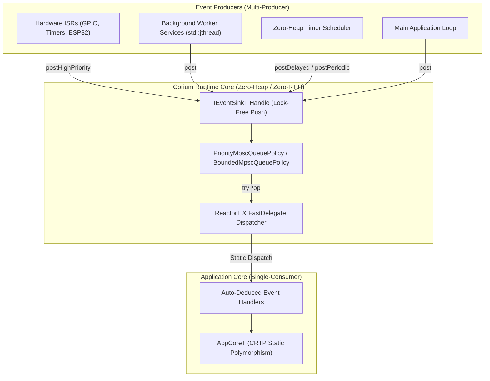

# Corium

**Corium** is a high-performance, header-only C++20 framework designed for **Multi-Producer Single-Consumer (MPSC)** event-driven architectures.

Engineered equally for **high-performance desktop applications (GUI event loops, game engines, audio/DSP processing, real-time desktop tools)** and **embedded microcontrollers & RTOS (ARM Cortex-M, ESP32, FreeRTOS, Zephyr)**, Corium guarantees **zero dynamic memory allocations** on the heap, **zero virtual table / RTTI overhead**, and **pure compile-time static dispatching**.

---

## What is Corium?

Traditional C++ event libraries rely heavily on `std::function`, dynamic memory allocation (`new`/`malloc`), and virtual method dispatch (`override`). In real-time desktop software (game loops, audio engines, responsive UIs) or resource-constrained embedded systems, these mechanisms introduce:
- **Non-deterministic latency spikes** due to heap allocation and lock contention.
- **Memory fragmentation** over long execution periods.
- **Virtual table (vtables) and RTTI overhead**, which bloat binary size and reduce CPU cache efficiency.

**Corium solves this completely** by moving all type resolution, storage allocation, and policy choices to **compile time**. Multiple concurrent producers (hardware ISRs, background worker threads, user input events, timer loops) push events into a lock-free Vyukov ring buffer without acquiring locks or allocating heap memory. A single consumer thread processes and dispatches events via CRTP static polymorphism and FastDelegates.

---

## Architecture Overview



---

## Key Features

### Core Performance
- **Zero-Heap Allocation Guaranteed**: Hot-path event enqueueing, timer scheduling, and handler dispatching operate with **0 dynamic heap allocations**.
- **Zero RTTI & Zero Vtables**: Compiles cleanly with `-fno-rtti` and `-fno-exceptions`. Virtual methods are replaced by **CRTP static polymorphism** and FastDelegates.
- **Lock-Free MPSC Engine**: Multiple hardware interrupt handlers (ISRs) and worker threads push concurrently into Dmitry Vyukov's lock-free ring buffer algorithm.

### Priority & Overflow Management
- **Multi-Tier Event Priorities**: Native support for strict event priorities (`EventPriority::High`, `Normal`, `Low`). High-priority interrupt and emergency events are guaranteed to be dispatched ahead of standard background events.
- **Configurable Overflow Policies**: Transparent queue saturation strategies (`DropNewestOverflowPolicy`, `DropOldestOverflowPolicy`, `AuditOverflowPolicy`, `PanicOverflowPolicy`).

### Timers & Concurrency
- **Zero-Heap Timer Scheduler**: Schedule single-shot delayed events (`postDelayed()`) or recurring periodic events (`postPeriodic()`) with cancellation handles (`cancelTimer()`) using static fixed-capacity storage.
- **Multi-Threaded Background Services**: Managed worker loops using C++20 `std::jthread` and `std::stop_token`, posting events concurrently with zero heap allocation.
- **ESP32 & Embedded RTOS Native**: Lock-free event posting directly from hardware GPIO ISR handlers and FreeRTOS tasks.

---

## Feature Comparison Matrix

| Feature | Corium | Traditional Event Systems |
| :--- | :--- | :--- |
| **Dynamic Memory** | **0 Heap Allocations** (Static Arrays & Inline SBO) | Heap Allocation (`new`, `malloc`, `std::function`) |
| **Dispatch Mechanism** | **CRTP Static Polymorphism & FastDelegate** | Virtual Tables (`override`) & RTTI |
| **Thread Safety** | **Lock-Free MPSC** (Signal & ISR Safe) | Mutex Locks & Condition Variables |
| **Interrupt Safety (ISR)** | **100% Safe** (Non-blocking lock-free pushes) | Unsafe (Locks can deadlock ISR) |
| **Priority Channels** | **Strict Multi-RingBuffer Priority Draining** | Dynamic Sorting / Heap Priority Queues |
| **Timer Scheduling** | **Zero-Heap Static Scheduler** | Dynamic Heap Timer Wheels / Heap Min-Heaps |
| **Bare-Metal Support** | **Full Support** (`-fno-rtti -fno-exceptions`) | Poor / Requires Heap & RTTI |

---

## Quick Start & Code Examples

### 1. Minimal Application Example (CRTP & Zero-Heap)

```cpp
#include <corium/corium.hpp>
#include <iostream>

using namespace corium;

// Application inherits statically via CRTP
class DemoApp : public AppCore<DemoApp> {
public:
    void onRegisterHandlers() {
        // Auto-deduces UpdateEvent from lambda argument signature
        on([this](const UpdateEvent& event) {
            _frameCount++;
            std::cout << "Frame #" << _frameCount << " (dt: " << event.deltaTime << "s)\n";

            if (_frameCount >= 5) {
                requestQuit();
            }
        });
    }

    void onInitialize() {
        std::cout << "DemoApp initialized.\n";
    }

    void onShutdown() {
        std::cout << "DemoApp shutdown complete.\n";
    }

private:
    int _frameCount = 0;
};

int main() {
    Runtime runtime;
    DemoApp app;

    runtime.initialize(app);

    while (!runtime.quitRequested()) {
        runtime.eventSink().post(UpdateEvent{0.016}); // ~60 FPS dt
        runtime.pump();
    }

    runtime.shutdown();
    return 0;
}
```

---

### 2. Event Priorities & High-Priority ISR Handling

```cpp
#include <corium/corium.hpp>
#include <iostream>

using namespace corium;

struct NormalUpdateEvent { int frame; };
struct EmergencyStopEvent { const char* reason; };

using AppEvents = std::variant<QuitEvent, NormalUpdateEvent, EmergencyStopEvent>;

// Configure Runtime with PriorityMpscQueuePolicy
using PriorityRuntime = RuntimeBuilder<>
    ::WithEvents<AppEvents>
    ::WithPriorityQueue<256, 1024>
    ::Build;

class PriorityApp : public AppCoreT<PriorityApp, PriorityRuntime::EventBusType> {
public:
    void onRegisterHandlers() {
        on([](const NormalUpdateEvent& e) {
            std::cout << "  [Normal] Processing Frame #" << e.frame << "\n";
        });

        on([this](const EmergencyStopEvent& e) {
            std::cout << "[HIGH PRIORITY ISR/EMERGENCY] Triggered: " << e.reason << "\n";
            requestQuit();
        });
    }
};

int main() {
    PriorityRuntime runtime;
    PriorityApp app;
    runtime.initialize(app);

    auto sink = runtime.eventSink();

    // Post normal events
    sink.post(NormalUpdateEvent{1});
    sink.post(NormalUpdateEvent{2});

    // Post high-priority event (simulating ISR/Interrupt)
    sink.postHighPriority(EmergencyStopEvent{"Over-temperature threshold exceeded!"});

    // High-priority event executes FIRST when pump() is called
    runtime.pump();

    runtime.shutdown();
    return 0;
}
```

---

### 3. Zero-Heap Timer Scheduler (Delayed & Periodic Events)

```cpp
#include <corium/corium.hpp>
#include <iostream>

using namespace corium;

struct HeartbeatEvent {};
struct DelayedAlertEvent { const char* message; };

using AppEvents = std::variant<QuitEvent, HeartbeatEvent, DelayedAlertEvent>;

using TimerRuntime = RuntimeBuilder<>
    ::WithEvents<AppEvents>
    ::WithMaxTimers<32>
    ::Build;

class TimerApp : public AppCoreT<TimerApp, TimerRuntime::EventBusType> {
public:
    TimerId heartbeatTimerId = INVALID_TIMER_ID;

    void onRegisterHandlers() {
        on([this](const HeartbeatEvent&) {
            _heartbeats++;
            std::cout << "[Periodic Heartbeat #" << _heartbeats << "] System healthy.\n";

            if (_heartbeats >= 3) {
                cancelTimer(heartbeatTimerId);
                requestQuit();
            }
        });

        on([](const DelayedAlertEvent& e) {
            std::cout << "[Delayed Notification] " << e.message << "\n";
        });
    }

    void onInitialize() {
        // Schedule single-shot delayed event after 100ms
        postDelayed(DelayedAlertEvent{"100ms delayed timer fired!"}, std::chrono::milliseconds(100));

        // Schedule periodic heartbeat every 50ms
        heartbeatTimerId = postPeriodic(HeartbeatEvent{}, std::chrono::milliseconds(50));
    }

private:
    int _heartbeats = 0;
};

int main() {
    TimerRuntime runtime;
    TimerApp app;
    runtime.initialize(app);

    while (!runtime.quitRequested()) {
        runtime.waitAndPump(std::chrono::milliseconds(20));
    }

    runtime.shutdown();
    return 0;
}
```

---

### 4. ESP32 & FreeRTOS GPIO Interrupt (ISR) Integration

```cpp
#include <corium/corium.hpp>
#include <driver/gpio.h>
#include <freertos/FreeRTOS.h>
#include <freertos/task.h>
#include <iostream>

using namespace corium;

static constexpr gpio_num_t BUTTON_GPIO = GPIO_NUM_27;

struct ButtonPressEvent { uint8_t pin; };
using Esp32Events = std::variant<QuitEvent, ButtonPressEvent>;

using Esp32Runtime = RuntimeBuilder<>
    ::WithEvents<Esp32Events>
    ::WithCapacity<256>
    ::WithSignalPolicy<NoSignalPolicy>
    ::WithStoragePolicy<CompactStoragePolicy>
    ::Build;

class Esp32FirmwareApp : public AppCoreT<Esp32FirmwareApp, Esp32Runtime::EventBusType> {
public:
    void onRegisterHandlers() {
        on([](const ButtonPressEvent& e) {
            std::cout << "[ESP32] Button Press ISR on GPIO " << (int)e.pin << "\n";
        });
    }
};

static Esp32Runtime g_runtime;
static Esp32FirmwareApp g_app;

using EventSinkType = decltype(g_runtime.eventSink());
static EventSinkType g_sink;

// Hardware ISR handler (executed in IRAM interrupt context)
static void IRAM_ATTR gpio_button_isr_handler(void* arg) {
    auto sink = static_cast<EventSinkType*>(arg);
    sink->post(ButtonPressEvent{static_cast<uint8_t>(BUTTON_GPIO)}); // Lock-free push from ISR
}

extern "C" void app_main(void) {
    g_runtime.initialize(g_app);
    g_sink = g_runtime.eventSink();

    gpio_config_t io_conf{};
    io_conf.intr_type = GPIO_INTR_NEGEDGE;
    io_conf.mode = GPIO_MODE_INPUT;
    io_conf.pin_bit_mask = 1ULL << static_cast<uint64_t>(BUTTON_GPIO);
    io_conf.pull_up_en = GPIO_PULLUP_ENABLE;
    gpio_config(&io_conf);

    gpio_install_isr_service(0);
    gpio_isr_handler_add(BUTTON_GPIO, gpio_button_isr_handler, &g_sink);

    while (!g_runtime.quitRequested()) {
        g_runtime.pump();
        vTaskDelay(pdMS_TO_TICKS(10));
    }
}
```

---

### 5. Multi-Threaded Background Services & `ServiceRegistry`

```cpp
#include <corium/corium.hpp>
#include <chrono>
#include <iostream>
#include <thread>

using namespace corium;

// Background Worker Service (runs on its own std::jthread)
class SensorService : public BackgroundService<> {
public:
    void run(std::stop_token stopToken) {
        double elapsed = 0.0;
        while (!stopToken.stop_requested()) {
            postEvent(TickEvent{elapsed});
            elapsed += 0.2;
            std::this_thread::sleep_for(std::chrono::milliseconds(200));
        }
    }
};

class MultiThreadApp : public AppCore<MultiThreadApp> {
public:
    SensorService sensorService;

    void onConfigureServices(ServiceRegistry& registry) {
        registry.registerService(sensorService);
    }

    void onRegisterHandlers() {
        on([](const TickEvent& e) {
            std::cout << "Sensor Tick received (time: " << e.deltaTime << "s)\n";
        });
    }
};

int main() {
    Runtime runtime;
    MultiThreadApp app;

    // Automatically launches all registered background service jthreads
    runtime.initialize(app);

    while (!runtime.quitRequested()) {
        runtime.waitAndPump(std::chrono::milliseconds(50));
    }

    // Signals stop_token and cleanly joins background threads
    runtime.shutdown();
    return 0;
}
```

---

## Policy-Based Architecture & `RuntimeBuilder`

Corium provides a flexible policy-based modular architecture allowing developers to configure queue types, overflow handling, signaling strategies, and memory footprints at compile time:

| Policy Area | Available Strategies | Description |
| :--- | :--- | :--- |
| **`QueuePolicy`** | `BoundedMpscQueuePolicy`<br>`PriorityMpscQueuePolicy`<br>`BlockingQueuePolicy` | Lock-free MPSC Vyukov ring buffer, multi-channel priority queue, or mutex-protected queue. |
| **`OverflowPolicy`** | `DropNewestOverflowPolicy`<br>`DropOldestOverflowPolicy`<br>`AuditOverflowPolicy`<br>`PanicOverflowPolicy` | Defines behavior when queue is full (drop newest, evict oldest, audit atomic counter, or assert/panic). |
| **`TimerStoragePolicy`**| `FixedTimerStoragePolicy<MaxTimers>` | Configures static array capacity for delayed and periodic timers. |
| **`SignalPolicy`** | `NoSignalPolicy`<br>`CallbackSignalPolicy`<br>`AtomicWaitSignalPolicy`<br>`EventFdSignalPolicy` | Busy-spin polling, edge callback, C++20 `atomic::wait()`, or Linux `eventfd`. |
| **`StoragePolicy`** | `DefaultStoragePolicy`<br>`CompactStoragePolicy`<br>`LargeStoragePolicy` | Configures max handlers per event type and FastDelegate inline SBO buffer size. |

### Building Custom Runtimes with `RuntimeBuilder`

```cpp
#include <corium/corium.hpp>

using namespace corium;

// Custom Event Variant List
struct TelemetryData { float temp; };
using MyEvents = std::variant<QuitEvent, TelemetryData>;

// Fluent Compile-Time Builder
using CustomEmbeddedRuntime = RuntimeBuilder<>
    ::WithEvents<MyEvents>
    ::WithPriorityQueue<128, 512>            // 128 High, 512 Normal priority slots
    ::WithOverflowPolicy<AuditOverflowPolicy> // Track dropped event counts
    ::WithMaxTimers<16>                      // Max 16 concurrent timers
    ::WithSignalPolicy<NoSignalPolicy>       // Zero-cost polling for bare-metal
    ::WithStoragePolicy<CompactStoragePolicy>// 4 handlers/event, 16B inline SBO
    ::Build;
```

---

## Unit Testing & Verification

Corium includes a comprehensive test suite powered by GoogleTest and CTest:

```bash
# Configure and build unit test suite
cmake -B build -DCORIUM_BUILD_TESTS=ON
cmake --build build

# Execute unit tests
ctest --test-dir build --output-on-failure
```

### Strict Bare-Metal Verification (`-fno-rtti -fno-exceptions`)

You can compile Corium with strict bare-metal flags to verify zero RTTI / zero exception dependency:

```bash
g++ -std=c++20 -fno-rtti -fno-exceptions -Iinclude samples/01_basic_app/main.cpp -o my_app
./my_app
```

---

## CMake Integration

Corium is a header-only library target using CMake `INTERFACE`:

```cmake
cmake_minimum_required(VERSION 3.14)
project(MyProject LANGUAGES CXX)

set(CMAKE_CXX_STANDARD 20)
set(CMAKE_CXX_STANDARD_REQUIRED ON)

# Add Corium header-only library
add_subdirectory(path/to/corium)

# Link your executable
add_executable(my_app main.cpp)
target_link_libraries(my_app PRIVATE corium)
```

---

## License

Corium is open-source software distributed under the [MIT License](file:///home/simone/dev/corium/LICENSE).
