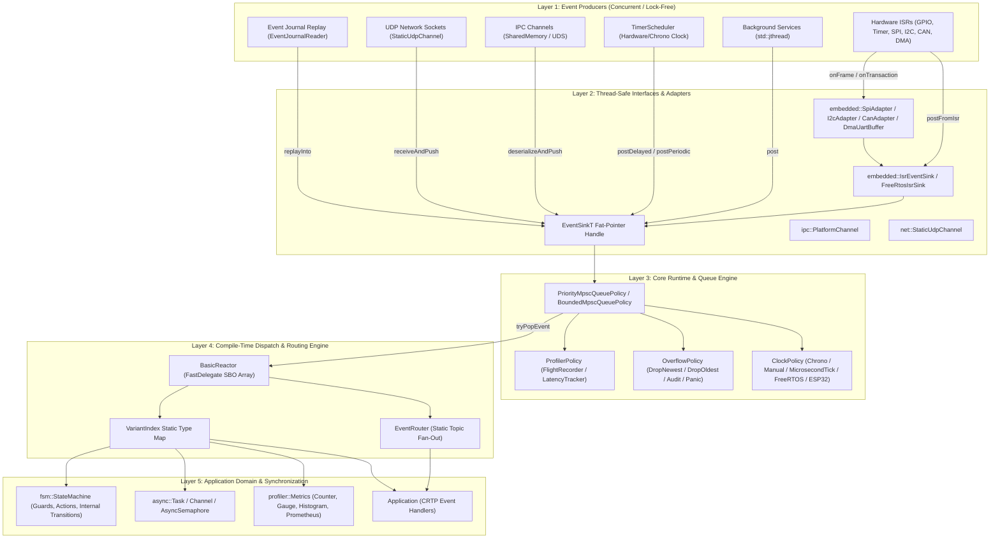
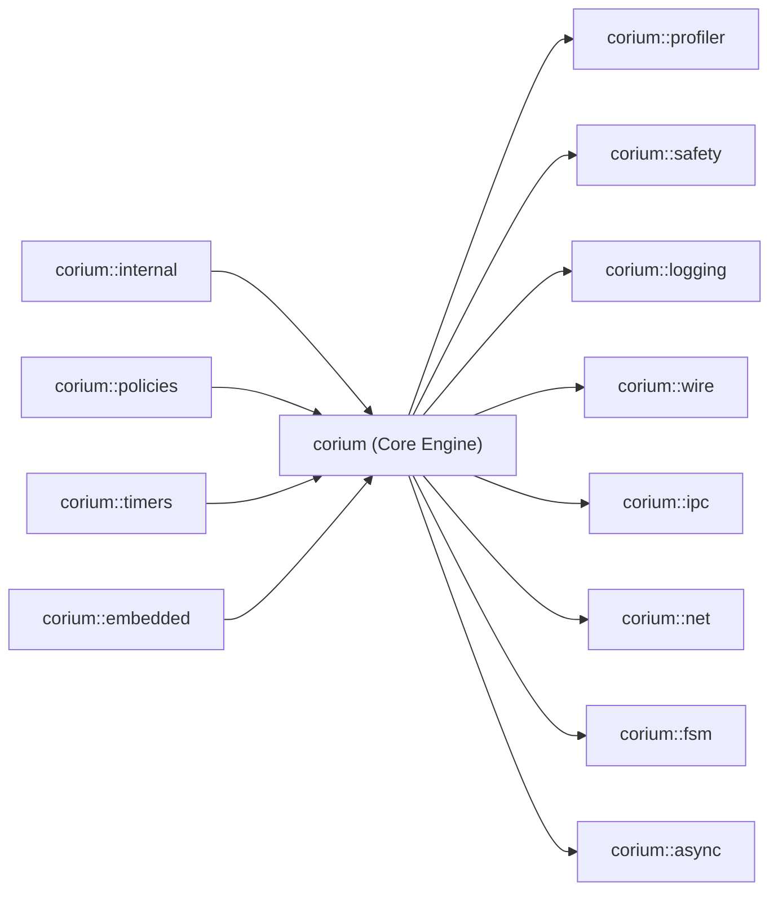

# Corium Architectural Design Document

## 1. Core Philosophy & Design Guarantees

**Corium** is engineered from the ground up to solve the fundamental trade-offs in real-time and embedded C++ event systems:

```
┌─────────────────────────────────────────────────────────────────────────────┐
│                           CORIUM DESIGN PILLARS                             │
├─────────────────────────┬─────────────────────────┬─────────────────────────┤
│    Zero Dynamic Heap    │    Zero RTTI & Vtable   │    Lock-Free Engine     │
│   All buffers, queues,  │   Static polymorphism   │    Dmitry Vyukov MPSC   │
│   delegates, and tasks  │   via CRTP and lambda   │    ring buffer enables  │
│   allocated statically  │   inlining with zero    │    safe multi-producer  │
│   at compile time.      │   vtable dereferences.  │    posting from ISRs.   │
└─────────────────────────┴─────────────────────────┴─────────────────────────┘
```

---

## 2. Layered Architecture



---

## 3. End-to-End Event Processing Flow

When an event is produced and dispatched, it follows a deterministic sequence:

```
[Producer Thread / ISR / DMA / Socket]
  │
  ├─ 1. Sink.post(event, priority)
  │      ├─ ProfilerPolicy::onEventPosted()
  │      ├─ ProfilerPolicy::recordPostTime(timestamp)
  │      └─ MpscRingBuffer::push(event) (Lock-free atomic head/tail)
  ▼
[Queue Buffer]
  │
  ▼
[Single-Consumer Main Loop / Runtime::pump()]
  │
  ├─ 2. EventBus::processOne()
  │      ├─ MpscRingBuffer::tryPop(event)
  │      ├─ ProfilerPolicy::takePostTime()
  │      ├─ Reactor::dispatch(event)
  │      │     ├─ VariantIndex lookup (O(1) direct array indexing)
  │      │     ├─ FastDelegate invocation -> Application::onEvent(event)
  │      │     └─ EventRouter::publish(topicId, event) (Fan-Out)
  │      └─ ProfilerPolicy::onEventDispatched(latency, duration)
  ▼
[Domain Handler / FSM / Coroutine Executed]
```

---

## 4. Policy-Based Architecture Matrix

Corium uses compile-time policy classes to adapt its behavior without run-time overhead:

| Policy Axis | Available Implementations | Characteristics | Default Choice |
|---|---|---|---|
| **Queue Policy** | `BoundedMpscQueuePolicy<E, N>`<br>`PriorityMpscQueuePolicy<E, N>` | Lock-free Vyukov ring buffer; multi-tier priority queues (High/Normal/Low) | `BoundedMpscQueuePolicy<DefaultEvents, 1024>` |
| **Overflow Policy** | `DropNewestOverflowPolicy`<br>`DropOldestOverflowPolicy`<br>`AuditOverflowPolicy`<br>`PanicOverflowPolicy` | Drop newly posted event; overwrite oldest; record audit drop counts; assert/abort | `DropNewestOverflowPolicy` |
| **Signal Policy** | `NoSignalPolicy`<br>`ConditionVariableSignalPolicy` | Busy-polling / sleep-yield loop; CV notification on push | `NoSignalPolicy` |
| **Clock Policy** | `ChronoClockPolicy`<br>`ManualClockPolicy`<br>`MicrosecondTickClockPolicy`<br>`MillisecondTickClockPolicy`<br>`EspTimerClockPolicy`<br>`FreeRtosClockPolicy` | std::chrono; simulated manual step; bare-metal hardware tick; ESP32 timer; FreeRTOS ticks | `ChronoClockPolicy` |
| **Storage Policy** | `FixedStoragePolicy<32, 64>`<br>`CompactStoragePolicy<16, 16>` | Standard SBO handler size & capacity; compact storage for ultra-constrained MCUs | `FixedStoragePolicy<32, 64>` |
| **Profiler Policy** | `NullProfiler`<br>`LatencyTracker`<br>`FlightRecorderProfiler` | Zero overhead; min/max/avg latency; circular trace buffer with Chrome Tracing JSON export | `NullProfiler` |

---

## 5. Module Dependency Topology



---

## 6. Bare-Metal Embedded Memory Footprint & Resource Model

Corium guarantees deterministic performance on bare-metal ARM Cortex-M, ESP32, and RISC-V microcontrollers without an operating system or heap manager:

### 1. Zero Vtable & Zero RTTI Inlining
By utilizing the Curiously Recurring Template Pattern (CRTP) and Small Buffer Optimization (SBO) static delegates, handler invocations are directly inlined by the compiler down to single `ldr`/`str` load-store instructions. No virtual tables (`.rodata`) or typeinfo descriptors are generated in Flash.

### 2. Template Dead-Code Elimination
As a pure header-only C++20 framework, only instantiated template classes and methods generate machine code. Unused modules (such as UDP, IPC, or Prometheus metrics) produce **0 bytes of code** in Flash. Linking with `-ffunction-sections -fdata-sections -Wl,--gc-sections` strips all unused functions.

### 3. Resource Allocation Breakdown (ARM Cortex-M3 / M4 / M7)

| Memory Region | Typical Footprint | Description |
| :--- | :---: | :--- |
| **`.text` (Flash / ROM)** | **~3 - 6 KB** | Core runtime loop, lock-free ring buffer atomics, timer min-heap scheduler. |
| **`.data` + `.bss` (SRAM)** | **< 1 - 2 KB** | Static queue memory, event variant buffers, and timer scheduler slots. |
| **Heap (`malloc` / `free`)** | **0 Bytes** | Zero dynamic heap allocations across all operations. |
