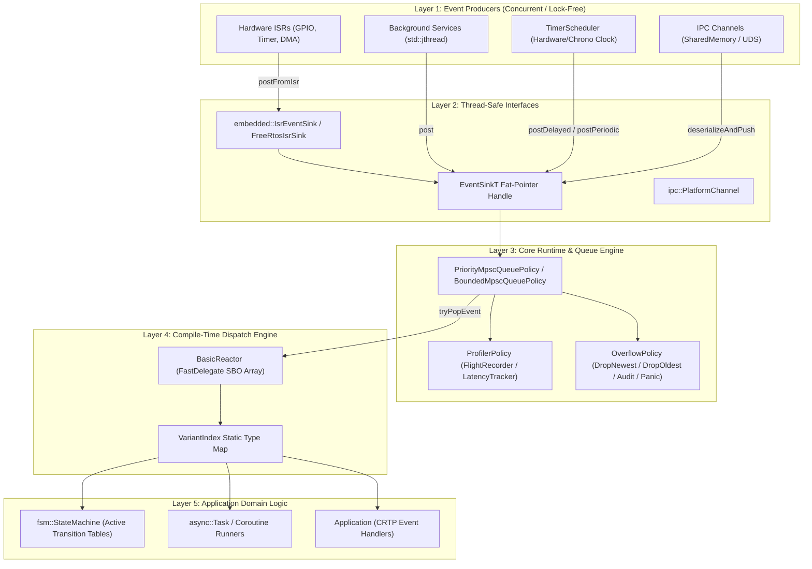
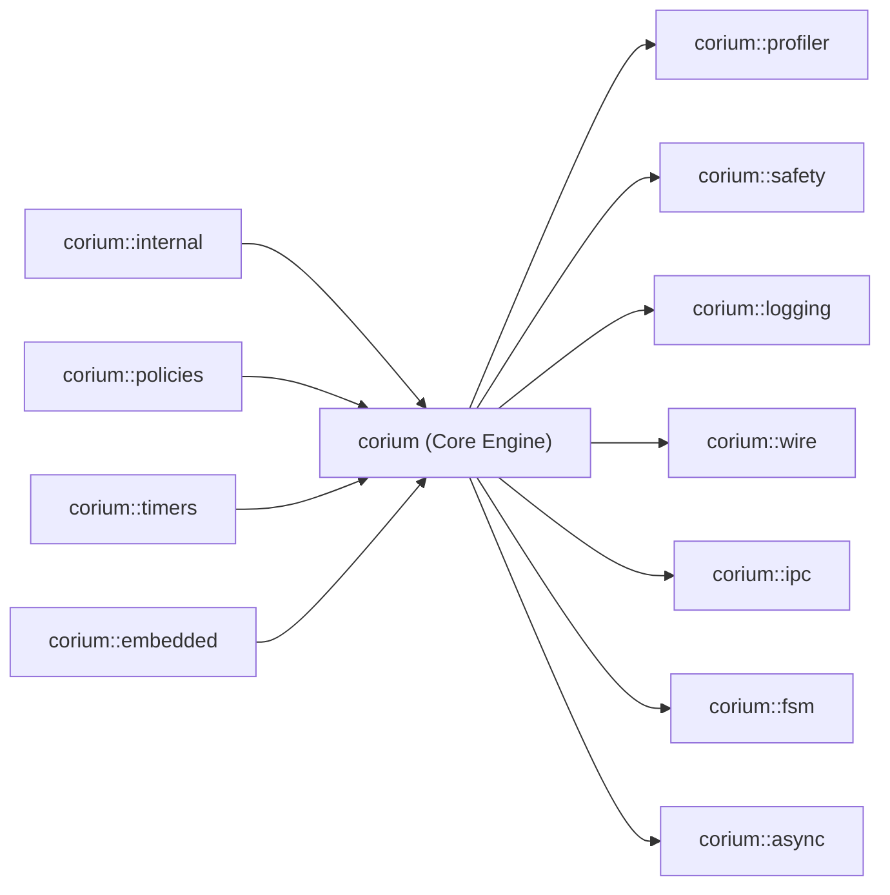

# Corium Architectural Design Document

## 1. Core Philosophy & Design Guarantees

**Corium** is engineered from the ground up to solve the fundamental trade-offs in real-time and embedded C++ event systems:

```
┌─────────────────────────────────────────────────────────────────────────────┐
│                           CORIUM DESIGN PILLARS                             │
├─────────────────────────┬─────────────────────────┬─────────────────────────┤
│    Zero Dynamic Heap    │    Zero RTTI & Vtable   │    Lock-Free Engine     │
│   All buffers, queues,  │   Static polymorphism   │    Dmitry Vyukov MPSC   │
│   delegates, and tasks  │   via CRTP and lambda   │    ring buffer enables  │
│   allocated statically  │   inlining with zero    │    safe multi-producer  │
│   at compile time.      │   vtable dereferences.  │    posting from ISRs.   │
└─────────────────────────┴─────────────────────────┴─────────────────────────┘
```

---

## 2. Layered Architecture



---

## 3. End-to-End Event Processing Flow

When an event is produced and dispatched, it follows a deterministic sequence:

```
[Producer Thread / ISR]
  │
  ├─ 1. Sink.post(event, priority)
  │      ├─ ProfilerPolicy::onEventPosted()
  │      ├─ ProfilerPolicy::recordPostTime(timestamp)
  │      └─ MpscRingBuffer::push(event) (Lock-free atomic head/tail)
  ▼
[Queue Buffer]
  │
  ▼
[Single-Consumer Main Loop / Runtime::pump()]
  │
  ├─ 2. EventBus::processOne()
  │      ├─ MpscRingBuffer::tryPop(event)
  │      ├─ ProfilerPolicy::takePostTime()
  │      ├─ Reactor::dispatch(event)
  │      │     ├─ VariantIndex lookup (O(1) direct array indexing)
  │      │     └─ FastDelegate invocation -> Application::onEvent(event)
  │      └─ ProfilerPolicy::onEventDispatched(latency, duration)
  ▼
[Domain Handler Executed]
```

---

## 4. Policy-Based Architecture Matrix

Corium uses compile-time policy classes to adapt its behavior without run-time overhead:

| Policy Axis | Available Implementations | Characteristics | Default Choice |
|---|---|---|---|
| **Queue Policy** | `BoundedMpscQueuePolicy<E, N>`<br>`PriorityMpscQueuePolicy<E, N>` | Lock-free Vyukov ring buffer; multi-tier priority queues (High/Normal/Low) | `BoundedMpscQueuePolicy<DefaultEvents, 1024>` |
| **Overflow Policy** | `DropNewestOverflowPolicy`<br>`DropOldestOverflowPolicy`<br>`AuditOverflowPolicy`<br>`PanicOverflowPolicy` | Drop newly posted event; overwrite oldest; record audit drop counts; assert/abort | `DropNewestOverflowPolicy` |
| **Signal Policy** | `NoSignalPolicy`<br>`ConditionVariableSignalPolicy` | Busy-polling / sleep-yield loop; CV notification on push | `NoSignalPolicy` |
| **Clock Policy** | `ChronoClockPolicy`<br>`ManualClockPolicy`<br>`MicrosecondTickClockPolicy`<br>`EspTimerClockPolicy`<br>`FreeRtosClockPolicy` | std::chrono; simulated manual step; bare-metal hardware tick; ESP32 timer; FreeRTOS ticks | `ChronoClockPolicy` |
| **Profiler Policy** | `NullProfiler`<br>`LatencyTracker`<br>`FlightRecorderProfiler` | Zero overhead; min/max/avg latency; circular trace buffer with Chrome Tracing JSON export | `NullProfiler` |

---

## 5. Module Dependency Topology


